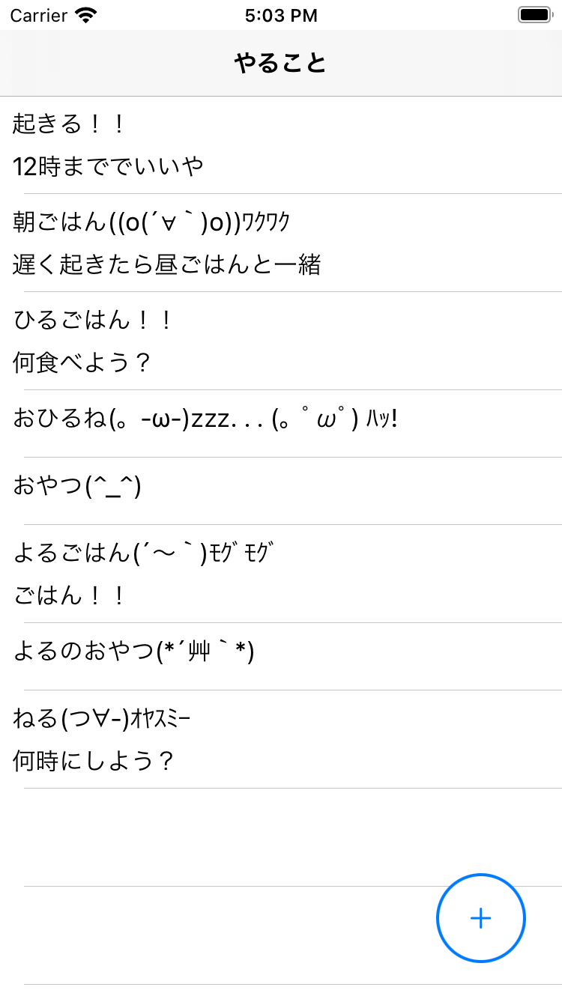
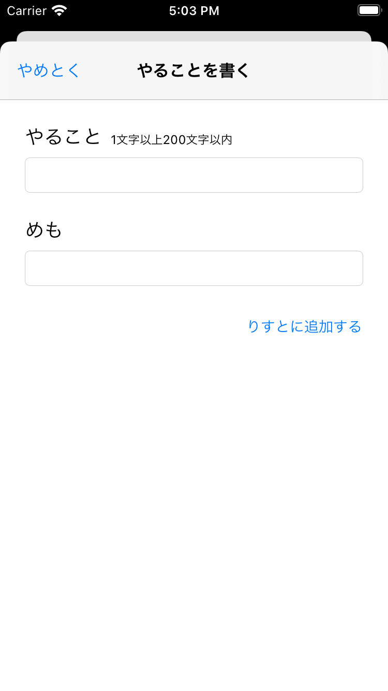

# 画面
## 一覧画面
※フィルタ機能がつけられると良さそう

## 新規作成画面
※期限も入力できると良さそう

## 変更画面

# メモの要件
## タイトル
- 必ず含む
- 50文以内

## 本文
- 任意
- 200文字以内

## その他
有効でない入力のときは作成ボタンを押せないようにするとか？
varをできるだけ非公開にする
IDの違う（無い）ものを更新したらどうなる？
